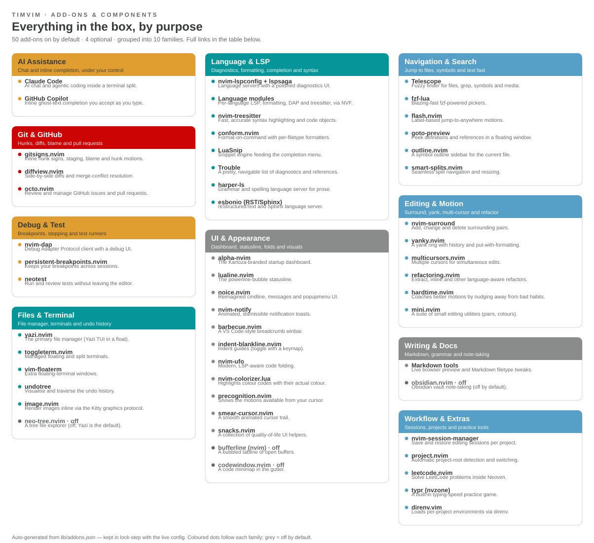

# Overview

KARTOZA · NEOVIM

timvim is not a bare editor — it is a curated distribution. On top of plain
Neovim it layers language servers, fuzzy finding, git tooling, AI assistance,
debugging, a themed dashboard and dozens of quality-of-life plugins, all wired
together declaratively so they simply work the moment you launch.

This page is the map. It shows **what is in the box and why** — every add-on
grouped by the job it does. When you hit a task ("how do I search?", "where is
git?", "what gives me completion?"), find the family here, then jump to the
matching page in the [User Guide](../user-guide/index.md).

## The add-ons at a glance

The diagram below is generated automatically from timvim's live configuration,
so it always reflects exactly what ships today.

{ .kz-figure }

For the full list — every add-on with a one-line purpose and a link to its
upstream project — see **[Add-ons & Components](addons.md)**.

## How the families fit together

-   :material-robot-outline:{ .lg .middle } **AI Assistance**

    ---

    Claude Code for chat and agentic edits; Copilot for inline ghost text.
    Optional and transparent — see the [AI policy](../about/ai-policy.md).

-   :material-language-python:{ .lg .middle } **Language & LSP**

    ---

    Diagnostics, formatting, snippets and treesitter syntax for every supported
    language. See [Diagnostics & LSP](../user-guide/lsp.md).

-   :material-magnify:{ .lg .middle } **Navigation & Search**

    ---

    Telescope, fzf-lua, flash motions and the Yazi file manager. See
    [Navigation & Search](../user-guide/navigation.md).

-   :material-source-branch:{ .lg .middle } **Git & GitHub**

    ---

    Gitsigns hunks, Diffview and Octo for pull requests. See the
    [Git Workflow](../user-guide/git.md).

-   :material-bug-outline:{ .lg .middle } **Debug & Test**

    ---

    nvim-dap with persistent breakpoints and Neotest. See
    [Debugging](../user-guide/debugging.md).

-   :material-palette-outline:{ .lg .middle } **UI & Appearance**

    ---

    The dashboard, statusline, notifications, folds and the Kartoza theme.
    See the [Design Aesthetic](../about/design.md).

!!! note "Kept honest automatically"
    The diagram and the [Add-ons table](addons.md) are generated by
    `lib/gen-addons-docs.py` from `lib/addons.json`, which is **drift-checked**
    against the `config/` tree at build time. Add or remove a plugin and the
    docs build fails until this Overview is updated — so it can never quietly
    fall out of date.

Made with 💗 by [Kartoza](https://kartoza.com) · [Donate!](https://github.com/sponsors/timlinux) · [GitHub](https://github.com/timlinux/nix-vim)

