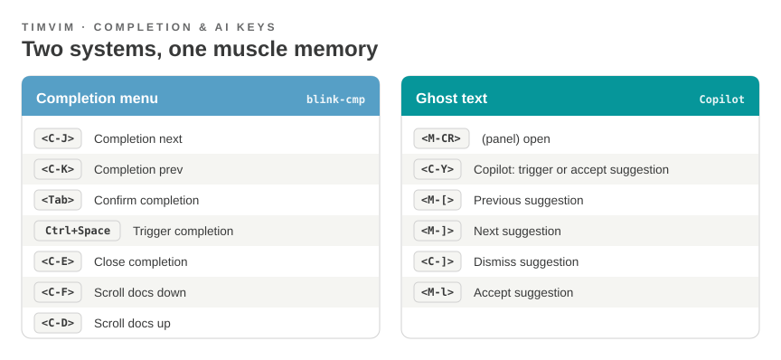

# Completion Keys

!!! info "Auto-generated"
    Generated from the live configuration — blink-cmp keys from the
    completion config, Copilot keys from the running editor.

timvim has **two** completion systems, kept deliberately apart:

- **blink-cmp** — the structured completion *menu* (LSP, snippets, paths).
- **Copilot** — inline **ghost text** you accept directly, no menu.

{ .kz-figure }

## Completion menu — blink-cmp

| Key | Action |
|-----|--------|
| `<C-J>` | Completion next |
| `<C-K>` | Completion prev |
| `<Tab>` | Confirm completion |
| `Ctrl+Space` | Trigger completion |
| `<C-E>` | Close completion |
| `<C-F>` | Scroll docs down |
| `<C-D>` | Scroll docs up |

## Ghost text — Copilot

| Key | Action |
|-----|--------|
| `<C-Y>` | Copilot: trigger or accept suggestion |
| `<C-]>` | Dismiss suggestion |
| `<M-CR>` | (panel) open |
| `<M-[>` | Previous suggestion |
| `<M-]>` | Next suggestion |
| `<M-l>` | Accept suggestion |

!!! tip "How to tell them apart"
    A **popup list** you scroll is blink-cmp. **Faint grey text** inline after
    the cursor is Copilot ghost text.
