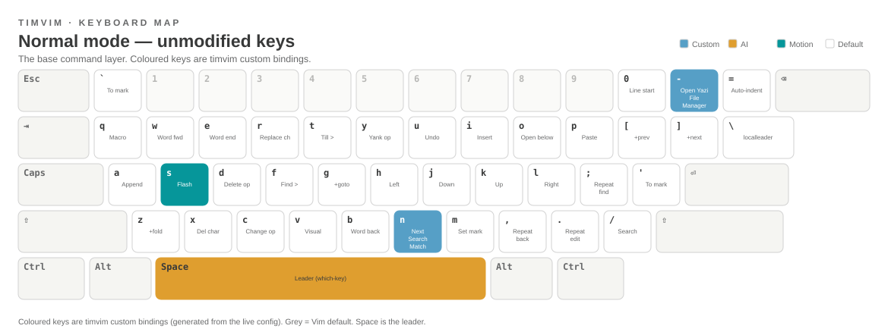
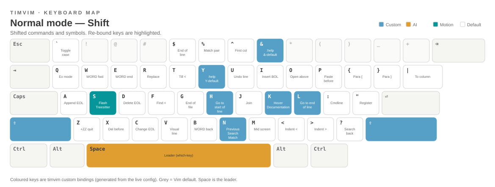
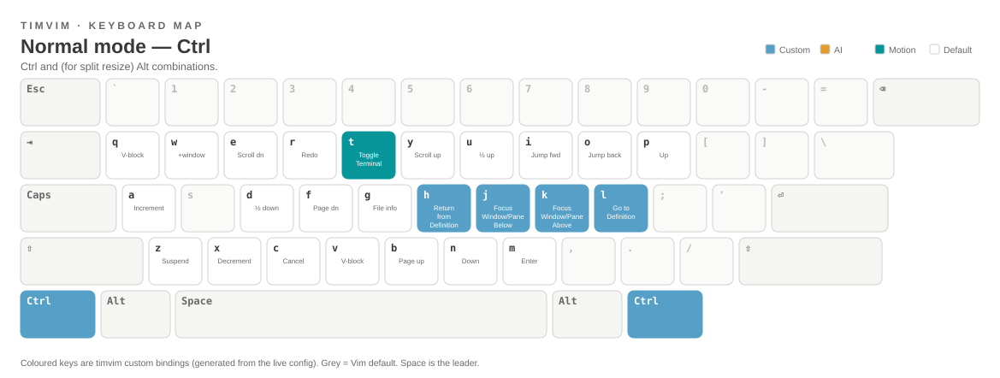
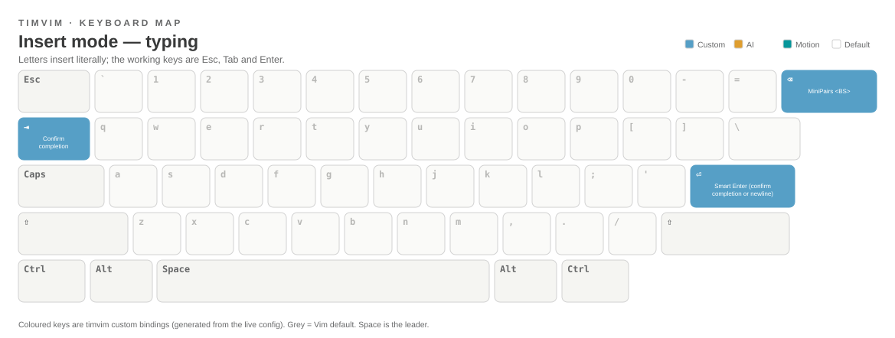
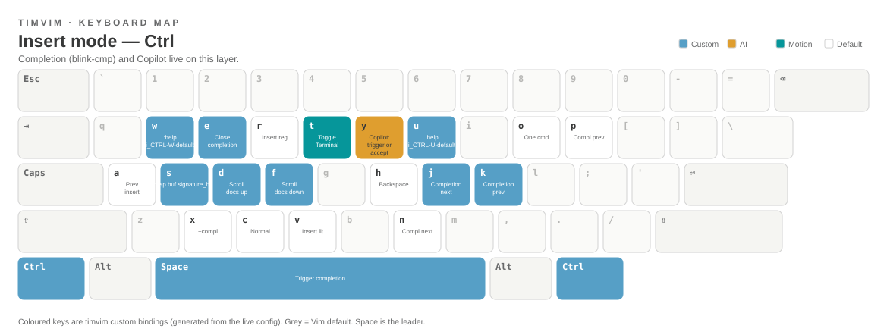
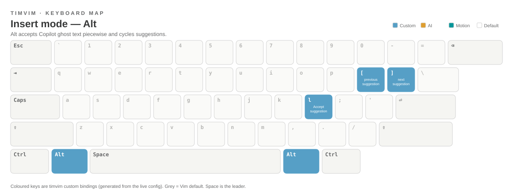

# Keyboard Layouts

These layouts show what **every physical key does**, one modifier layer at a
time. They are the fastest way to build muscle memory: coloured keys are
timvim's custom bindings, grey keys are standard Vim defaults.

!!! tip "How to read them"
    Each key shows its cap (top-left) and its function (centre). The legend
    marks **Custom** (timvim), **AI** (Copilot/Claude), **Motion** (Flash and
    movement) and **Default** (Vim). `Space` is the leader — its sub-menus live
    in the [Leader Key Map](which-key.md).

## Normal mode

Normal mode (Vim's "command" mode) is where you spend most of your time. Three
modifier layers cover it.

### Unmodified

{ .kz-figure }

`s` is **Flash jump** (not substitute), `-` opens the **Yazi** file manager,
and `Space` is the leader.

### With Shift

{ .kz-figure }

The re-bound keys are `H`/`L` (**start / end of line**), `K` (**hover docs**),
and `S`/`R` (**Flash Treesitter** jump and search).

### With Ctrl

{ .kz-figure }

`Ctrl`+`h`/`j`/`k`/`l` move between splits and `Ctrl`+`t` toggles the floating
terminal. Hold `Alt` instead of `Ctrl` with `h`/`j`/`k`/`l` to **resize** the
current split.

## Insert mode

In insert mode the letters type themselves — the useful bindings are on the
`Ctrl` and `Alt` layers, where completion and AI live.

### Typing

{ .kz-figure }

`Esc` returns to normal mode, `Tab` confirms a completion and `Enter` is
**Smart Enter** (accept the completion if the menu is open, otherwise a newline).

### With Ctrl

{ .kz-figure }

This is the **blink-cmp** completion layer: `Ctrl`+`j`/`k` move through the
menu, `Ctrl`+`Space` triggers it, `Ctrl`+`e` closes it, and `Ctrl`+`y` triggers
or accepts a **Copilot** suggestion.

### With Alt

{ .kz-figure }

`Alt` accepts **Copilot** ghost text piece by piece — `Alt`+`w` a word, `Alt`+`e`
a whole line — and `Alt`+`]` / `Alt`+`[` cycle between suggestions.

!!! note "See also"
    For the grouped, searchable list of every binding see the
    [Full Keymap](keymap.md); for the leader sub-menus see the
    [Which-Key Menus](which-key.md).
