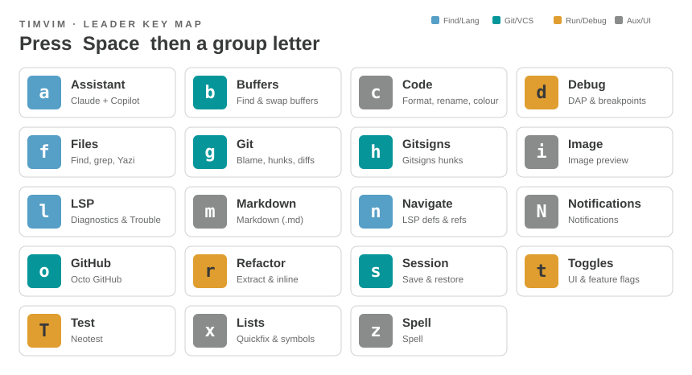

# Which-Key Menus

!!! info "Auto-generated"
    This page is generated from timvim's live keymaps. The group
    membership and counts come straight from the configuration.

Press ++space++ (the leader) and pause: the **which-key** popup lists every
group. Each group gathers related actions under one letter.

{ .kz-figure }

## Top-level groups

| Prefix | Group | Bindings |
|--------|-------|----------|
| `<leader>a` | [Assistant](keymap.md) | 8 |
| `<leader>b` | [Buffers](keymap.md) | 5 |
| `<leader>c` | [Code](keymap.md) | 8 |
| `<leader>d` | [Debug](keymap.md) | 21 |
| `<leader>f` | [Files](keymap.md) | 27 |
| `<leader>g` | [Git](keymap.md) | 8 |
| `<leader>h` | [Gitsigns](keymap.md) | 8 |
| `<leader>i` | [Image](keymap.md) | 1 |
| `<leader>l` | [LSP](keymap.md) | 5 |
| `<leader>m` | [Markdown](keymap.md) | 2 |
| `<leader>n` | [Navigate](keymap.md) | 7 |
| `<leader>N` | [Notifications](keymap.md) | 2 |
| `<leader>o` | [GitHub](keymap.md) | 23 |
| `<leader>r` | [Refactor](keymap.md) | 8 |
| `<leader>s` | [Session](keymap.md) | 5 |
| `<leader>t` | [Toggles](keymap.md) | 16 |
| `<leader>T` | [Test](keymap.md) | 7 |
| `<leader>x` | [Lists](keymap.md) | 3 |
| `<leader>z` | [Spell](keymap.md) | 6 |

## Non-leader groups

| Prefix | Group | Bindings |
|--------|-------|----------|
| `gp` | Goto Preview | 4 |
| `gz` | Surround | 3 |
| `gZ` | Surround (line) | 2 |

!!! note "See also"
    For every key in a group — with modes and actions — see the
    [Full Keymap](keymap.md). For the physical-key view, see the
    [Keyboard Layouts](keyboard.md).
